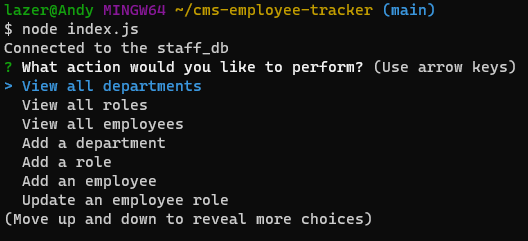
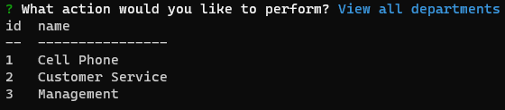
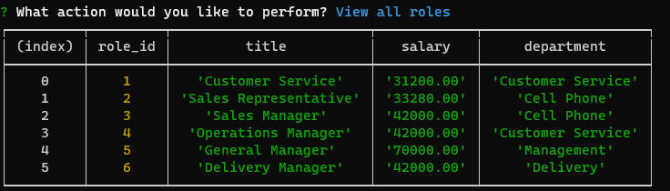
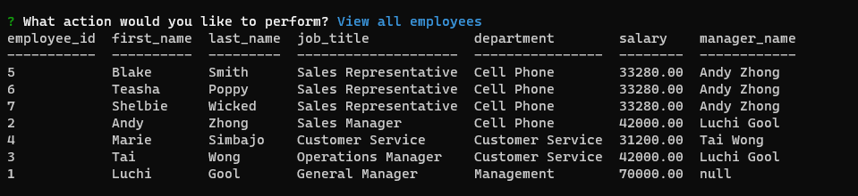
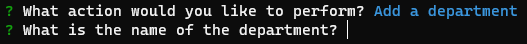
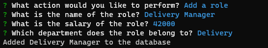
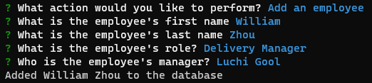
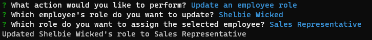

# CMS-Employee-Tracker

## Description

This project was created to learn to use MYSQL query statements with MYSQL2, how to make functions asynchronous, inquirer package and console.table
This project helped me learn how async functions work, and how without it the inquirer prompts will not wait for input and queries will not be ready.

## Usage

Run the program by typing in "node index.js" at the root directory. After running that command, you will be prompted with a series of actions to choose from.  

When View all departments is selected, it will display a table with all the departments

When View all roles is selected, it will display a table with all the roles, salary and the name of the department  

When View all employees is selected, it will display a table with all the employees, their first name, last name, job title, name of the department, salary and the manager's name

When add department is selected, user is prompted with "What is the name of the department", it will then be added to the database  

When add role is selected, user is prompted with "What is the name of the role?", "What is the salary of the role?" and it will list the departments for the role to go under.  

When add an employee is selected, user is prompted with "What is the employee's first name?", "What is the employee's last name?", a list of roles for the user to pick from, and a list of employee's to assign as their manager  

When update an employee is selected, user is prompted a list of employee's to pick from, then a list of roles you want to assign the employee

Walkthrough video URL: https://youtu.be/8V2ZgPerhYY  
GitHub Repo: https://github.com/TimeBytes/CMS-Employee-Tracker

## Credits

Used https://www.npmjs.com/package/mysql2#documentation for documentation for MYSQL2

## License

MIT LICENSE
